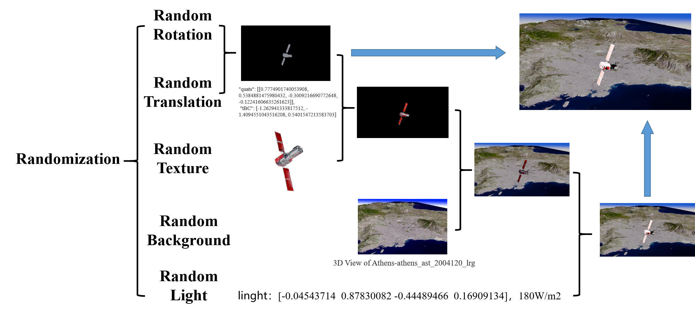

# Blender Domain Randomization Pose Dataset Generator
A Blender-based synthetic data generation pipeline for pose estimation with synchronized camera pose annotations.
This project uses **Blender 4.1** to generate synthetic datasets with **camera pose annotations** for 6D pose estimation and computer vision tasks.
Instead of using external scripts, the pipeline is implemented directly inside **Blender .blend files**, each representing a different level of domain randomization.


---
# Project Overview
The system is organized into four Blender scene files:
gaofen13_nothing.blender → Code1 (Basic rendering)
gaofen13_wenli.blender → Code2 (Object texture)
gaofen13_background.blender → Code3 (Background randomization)
gaofen13_light.blender → Code4 (Lighting randomization)

Each `.blend` file contains embedded Python scripts executed inside Blender.

---
# Key Features
- Camera pose-controlled rendering (quaternion + translation)
- Per-frame dynamic mesh loading (`0_post.obj`)
- Object-level texture randomization
- Background/environment switching
- Light direction randomization
- Fully self-contained Blender pipeline (no external script dependency)
- Blender 4.1 compatible
---
# Repository Structure
blender-pose-synthgen/
│
├── gaofen13_nothing.blender
├── gaofen13_wenli.blender
├── gaofen13_background.blender
├── gaofen13_light.blender
│
├── dataset/
│ ├── camera_pose.json
│
├── outputs/
│ ├── images/
│
└── README.md


---

## Input Format

### camera_pose.json

Each frame contains camera pose information:

```json
[
  {
    "filename": "0",
    "quats": [[w, x, y, z]],
    "tBC": [x, y, z]
  }
]
````

### Field Description

* **quats**: Camera rotation in quaternion format (w, x, y, z)
* **tBC**: Camera translation vector
* **filename**: Frame index

---

## Dataset Requirement

The target 3D object structure must follow:

```
gaofen_list_1/
    ├── 1/
    │   ├── 42-p36-h1-1.0-0.3-0.1/
    │       ├── update/
    │           ├── mesh/
    │               ├── 0_post.obj
```

---

## Usage (Blender 4.1)

Each stage is executed inside Blender.

### Code1 — Basic Rendering

* Open Blender file:

  * `gaofen13_nothing.blender`

### Code2 — Object Texture Randomization

* Open Blender file:

  * `gaofen13_wenli.blender`

### Code3 — Background Randomization

* Open Blender file:

  * `gaofen13_background.blender`

### Code4 — Full Domain Randomization (Lighting Included)

* Open Blender file:

  * `gaofen13_light.blender`

Then run the embedded Python scripts inside Blender Text Editor.

---

## Configuration

Modify dataset paths inside each `.blend` file script:

```python
json_file = r"D:\DR_datasets\camera_pose.json"
output_folder = r"D:\DR_datasets\output"
```

---

## Pipeline Description

### Code1: Basic Rendering

* Load camera pose
* Load mesh per frame
* Render RGB image

**Pipeline:**

```
Camera Pose → Mesh → Render
```

---

### Code2: Object Texture Randomization

* Applies texture variation to target object
* Each frame has different appearance

**Pipeline:**

```
Camera Pose → Mesh → Object Texture → Render
```

---

### Code3: Background Randomization

* Replaces environment/background images
* Uses World Shader Image Texture node

**Pipeline:**

```
Camera Pose → Mesh → Object Texture → Background → Render
```

---

### Code4: Full Domain Randomization

* Adds lighting direction randomization
* Improves dataset diversity and robustness

**Key Implementation:**

```python
light_quats = matrix_quats(1)[0]
bpy.data.objects['light'].rotation_quaternion = light_quats
```

**Pipeline:**

```
Camera Pose → Mesh → Object Texture → Background → Lighting → Render
```

---

## Output

```
outputs/
    0001.png
    0002.png
    0003.png
    ...
    camera_pose.json
```

---

## Requirements

* Blender 4.1+
* NumPy (built-in in Blender Python)

---

This project is built with **Blender 4.1** for generating synthetic datasets with **camera pose annotations**, mainly for object detection, 6D pose estimation, and robotic vision tasks.
It provides a progressively enhanced rendering pipeline from basic rendering to full domain randomization.
